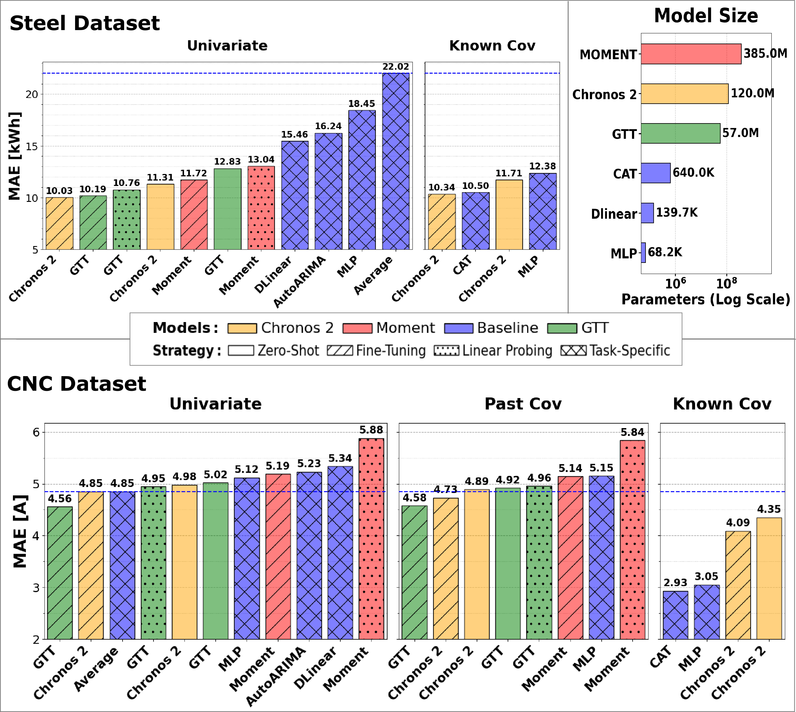
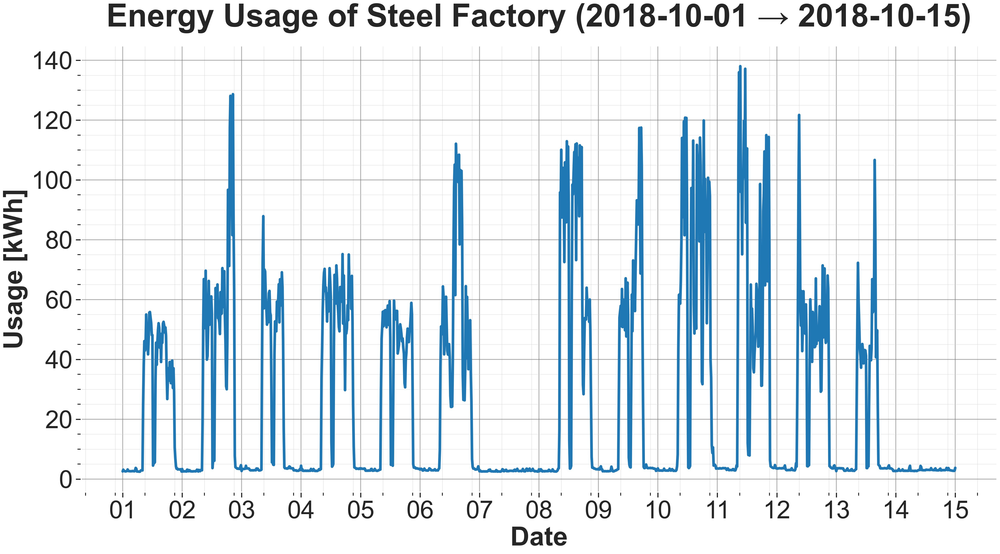
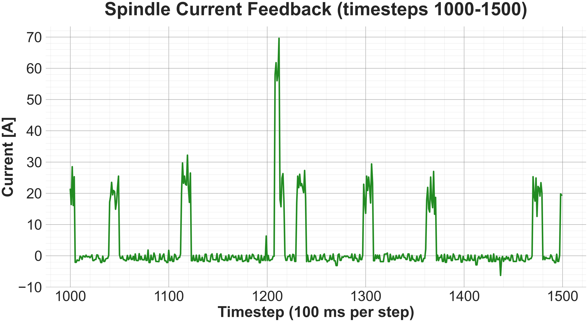

# A comparison of open time-series foundation models for industrial manufacturing applications

**Supplementary Material Repository**

This repository contains the supplementary data, experimental results, and hyperparameter configurations for the paper:

> **A comparison of open time-series foundation models for industrial manufacturing applications**
> 
> *Authors: Can Calisir, Simon Leszek*
> 
> *Conference: ESANN 2026*


## 📌  Summary

We benchmark three open-source time-series foundation models (Chronos 2, MOMENT, GTT) against classical baselines on **time-series forecasting tasks** using real-world **steel** (energy consumption) and **CNC** (milling tool wear) datasets.

**Key Finding:** TSFMs consistently outperform baselines in pattern-heavy tasks (steel) but trail behind simple regressors in dynamic, control-based environments (CNC) where domain-specific covariates are essential.

---

<details>
<summary><strong>Click to view full Abstract</strong></summary>

Large-scale, pre-trained foundation models have recently been introduced for time-series modeling. While typically evaluated on broad forecasting benchmarks, we assess their suitability for industrial manufacturing. We benchmark three open-source time series foundation models (TSFMs) on two representative datasets: steel-plant energy consumption and computer numerical control (CNC) milling spindle current. In the structured, pattern driven steel setting, TSFMs consistently outperform classical baselines, even without task-specific training. In contrast, the highly dynamic CNC process reveals limited TSFM gains without domainspecific signals, with simple models excelling once control covariates are provided. These results highlight both the promise and current limitations of TSFMs for real-world industrial applications.
</details>

## 1. Experimental Results

We evaluate the zero-shot, linear probing, and fine-tuning performance of foundation models against classical baselines.

<p align="center">
  
  <br>
  <em>(Figure 1: Results for the steel (top left) and CNC (bottom) dataset by input features. Comparison by MAE, lower is better. Color encodes model family, patterns training strategies and overall sorting is based on performance. Dashed blue line is mean-predictor performance for reference. The top right panel reports the number of parameters (log scale) for the models)</em>
</p>

The complete numerical results (MAE) for all models and baselines across all experimental settings are available in the `results/` folder.

* [Download Full Results (Excel)](results/)
* [View Model Parameter Counts](results/model_sizes.xlsx)

## 2. Target Variable Analysis & Preprocessing
We evaluate two datasets representing distinct industrial regimes.

### A. Steel Industry Energy Consumption
* **Regime:** Structured, Pattern-Driven
* **Target Variable:** **Energy Consumption [kWh]** 
    * *Description:* The total energy usage of the plant over a year, aggregated every 15 minutes.
    * *Characteristics:* High regularity with strong daily and weekly seasonality.

 <p align="center">
  
  <br>
  <em>(Figure 2: Representative two-week segment of energy consumption, highlighting the strong daily and weekly seasonality)</em>
</p>
    
* **Known Covariates:** **Temporal Features** 
    * *Details:* Cyclic sine/cosine encodings of "hour-of-day" and "day-of-week."
    * *Role:* These capture the strong daily and weekly operational schedules driving consumption.
* **Preprocessing (Sliding Window):**
    * **Window Length:** 512 time steps
    * **Forecast Horizon:** 96 time steps (1 day)
    * **Stride:** 96 time steps
* **Data Split (Chronological):**
    * **Training:** January – August
    * **Test:** September – October
    * **Validation:** November – December
* **Insight:** This dataset represents a classic forecasting task where historical patterns strongly predict future values, favoring models that capture long-term dependencies.


### B. CNC Milling Spindle Current
* **Regime:** Highly Dynamic, Control-Based
* **Target Variable:** **Spindle Current Feedback [A]** 
    * *Description:* A proxy for tool load and wear, sampled at 10 Hz.
    * *Characteristics:* Non-stationary and irregular. The target variable is driven by machine control commands rather than historical seasonality.

<p align="center">
  
  <br>
  <em>(Figure 3: Representative segment of Spindle Current Feedback)</em>
</p>

* **Past Covariates:** **Physical Observations**
    * *Details:* Actual velocities and accelerations measured during the process.
* **Known Covariates:** **Control Parameters** 
    * *Details:* Planned velocities, planned accelerations, feed rate, and clamp pressure.
    * *Role:* These are the commands sent to the machine, which dictate the load on the spindle *before* it happens.
* **Preprocessing**
  * **Phase Filtering:** Dropped specific transitional phases from the `Machining_Process` log (`"Starting"`, `"Prep"`, `"End"`, and `"end"`).
    * These correspond to non-cutting operations (e.g., preparation, tracing up and down the "S" curve involving different layers, and repositioning the spindle as it moves through the air to a starting point). Removing them successfully isolates the active material-cutting process.
  * **Sliding Window Strategy:**
    * **Window Length:** 512 time steps
    * **Forecast Horizon:** 50 time steps
    * **Stride:** 50 time steps
* **Data Split (Experiment-Based):**
    * **Training:** Experiments 1, 2, 3, 4, 5, 6, 7, 8, 9, 10, 13, 14
    * **Validation:** Experiments 11, 12, 15
    * **Test:** Experiments 16, 17, 18
    * *Note:* The split ensures that training, validation, and test sets are representative of the different process configurations
* **Insight:** This dataset represents a dynamic task where the target variable changes largely due to external control signals, making it difficult for models to predict based on history alone.

## 4. Hyperparameters

A core focus of this paper is evaluating whether massive, generalized foundation models inherently outperform smaller, highly specialized models on specific industrial tasks. To ensure transparency and reproducibility, we have documented the architectures, parameter counts, and training configurations for the models evaluated.

Detailed specifications can be found in the dedicated configuration files below:

* **[Baselines](hyperparameters/baselines.md)**
* **[Time-Series Foundation Models](hyperparameters/foundation_models.md)**

## 📄 Citation

If you find this repository or our comparative findings useful in your research, please consider citing our work:

```bibtex
@inproceedings{can2026tsfm,
  title     = {A comparison of open time-series foundation models for industrial manufacturing applications},
  author    = {Can Calisir and Simon Leszek},
  booktitle = {Proceedings of the 34th European Symposium on Artificial Neural Networks, Computational Intelligence and Machine Learning (ESANN)},
  year      = {2026},
  publisher = {},
  url       = {}
}
```

## 📚 References & Acknowledgements

This repository builds upon open-source time-series models, and public datasets. We would like to acknowledge the following works:

### 🧠 Models
* **Chronos-2:** Ansari, A. F., et al. "Chronos-2: From Univariate to Universal Forecasting." (2025). [arXiv:2510.15821](https://arxiv.org/abs/2510.15821) | [GitHub](https://github.com/amazon-science/chronos-forecasting)
* **MOMENT:** Goswami, M., Szafer, K., Choudhry, A., Cai, Y., Li, S., & Dubrawski, A. (2024). "MOMENT: A Family of Open Time-series Foundation Models." *International Conference on Machine Learning (ICML)*. [arXiv:2402.03885](https://arxiv.org/abs/2402.03885) | [GitHub](https://github.com/moment-timeseries-foundation-model/moment)
* **GTT:** Feng, C., Huang, L., & Krompass, D. (2024). "General Time Transformer: an Encoder-only Foundation Model for Zero-Shot Multivariate Time Series Forecasting." *Proceedings of the 33rd ACM International Conference on Information and Knowledge Management (CIKM '24)*, 3757–3761. [DOI: 10.1145/3627673.3679931](https://doi.org/10.1145/3627673.3679931) | [GitHub](https://github.com/cfeng783/GTT)

### 📊 Datasets
* **Steel Industry Energy Consumption:** V E, Sathishkumar, Shin, Changsun, & Cho, Yongyun. (2021). *Steel Industry Energy Consumption Dataset*. UCI Machine Learning Repository. [DOI: 10.24432/C52G8C](https://doi.org/10.24432/C52G8C)
* **CNC Milling Spindle Current:** System-level Manufacturing and Automation Research Testbed (SMART) at the University of Michigan. (2018). *Tool Wear Detection in CNC Mill Dataset*. Kaggle. [Dataset Link](https://www.kaggle.com/datasets/shasun/tool-wear-detection-in-cnc-mill)
